# Research Condition Jump step by step
## General logic branch model ->  General logic skip model
``` mermaid
graph TD
  subgraph General Logic Branch <Skip> Model
      bStart_Skip[Skip Branch Start]  --> testCond_Skip(Test Condition<br>a>b)
      testCond_Skip     --> chkTstResult_Skip(Check test result<br>Get True or False)
      chkTstResult_Skip --> branch_Skip{Select Branch:<br>1,check TF list<br>2,select do}
      branch_Skip  -- True<br>SKIP False<br>DO NOTHING --> doTrue_Skip((_))
      branch_Skip  -- False --> doFalse_Skip(do<br>True<br>Thing)
      doTrue_Skip        --> bEnd_Skip[Branch End]
      doFalse_Skip       --> bEnd_Skip[Skip Branch End]
  end
  subgraph General Logic Branch Model
      bStart_General[Branch Start]  --> testCond_General(Test Condition<br>a>b)
      testCond_General     --> chkTstResult_General(Check test result<br>Get True or False)
      chkTstResult_General --> branch_General{Select Branch:<br>1,check TF list<br>2,select do}
      branch_General  -- True  --> doTrue_General(do<br>True<br>Thing)
      branch_General  -- False --> doFalse_General(do<br>False<br>Thing)
      doTrue_General        --> bEnd_General[Branch End]
      doFalse_General       --> bEnd_General[Branch End]
  end
```
## Skip model Circuit Implementation -> AVR Impl basic skip model 
* OPCODE: SBIS/C, SBRS/C, BRBS/C
``` mermaid
graph TD
  subgraph Branch <Skip> Model Impl SBXSC: SBIS/C SBRS/C BRBS/C
      bStart_SkipBitAVR[Skip Branch Start]  --> testCond_SkipBitAVR(OPCODE:do Test bit of<br>SFRL<IO5>/GPR/SREG)
      testCond_SkipBitAVR --> chkTstResult_SkipBitAVR(Check test result<br>Get True or False)
      chkTstResult_SkipBitAVR --> branch_SkipBitAVR{OPCODE:do<br>Select Branch:<br>Change PC<br>True=PC+2/3<br>False=PC+1}
      
      bEnd_BRBSC[BRBSC Skip Branch End]
      branch_SkipBitAVR  -- BRBSC True  --> doTrueXJMP_BRBSC((XJMP<br>S7<-64,63><br>NO-OPC))
      branch_SkipBitAVR  -- BRBSC False<br>SKIP True<br>DO NOTHING --> nullNode_BRBSC((_))
      nullNode_BRBSC    --> bEnd_BRBSC
      doTrueXJMP_BRBSC    --> doXJMP_BRBSC[Do True Routine]

      bEnd_SBXSC[SBXSC Skip Branch End]
      branch_SkipBitAVR  -- SBXSC True<br>SKIP False<br>DO NOTHING --> bEnd_SBXSC
      branch_SkipBitAVR  -- SBXSC False --> doFalse_SBXSC(doFalse<br>1/2 x word<br>OPCODE)
      doFalse_SBXSC      --> bEnd_SBXSC
  end
  subgraph General Branch <Skip> Model Implementation in Circuit
      bStart_SkipBitCircuit[Skip Branch Start]  --> testCond_SkipBitCircuit(Test Condition<br>SET=True:<br>TRUE=1=bit<1> AND 1<br>FALSE=0=bit<0> AND 1<br>CLR=True:<br>TRUE=1=bit<0> XOR 1<br>FALSE=0=bit<1> XOR 1)
      testCond_SkipBitCircuit     --> chkTstResult_SkipBitCircuit(Check test result<br>Get True or False)
      chkTstResult_SkipBitCircuit --> branch_SkipBitCircuit{Select Branch:<br>Change PC<br>True=PC+1+N<br>False=PC+1}
      branch_SkipBitCircuit  --> nullNode1_SKipBitCircuit
      nullNode1_SKipBitCircuit((+)) -- False<br>PC+1 --> doFalse_SkipBitCircuit(doFalse<br>Instruction)
      nullNode1_SKipBitCircuit((+)) -- True<br>PC+1+1/2--> nullNode2_SKipBitCircuit
      doFalse_SkipBitCircuit       --> nullNode2_SKipBitCircuit((+))
      nullNode2_SKipBitCircuit     --> bEnd_SkipBitCircuit[Skip Branch End]
  end
```
## AVR basic skip model -> IF-THENDO-ENDIF model
``` mermaid
graph TD
  subgraph Branch SKIP-IF-THENDO-ENDIF Model Impl SBXSC: SBIS/C SBRS/C BRBS/C
      bStart_ITE[SKIP-IF-THEN-END<br>Start]  --> testCond_ITE(IF<br>OPCODE:do Test bit of<br>SFRL<IO5>/GPR/SREG)
      testCond_ITE --> chkTstResult_ITE(Check test result<br>Get True or False)
      chkTstResult_ITE --> branch_ITE{OPCODE:do<br>Select Branch:<br>Change PC<br>True=PC+2/3<br>False=PC+1}
      
      bEnd_ITE_BRBSC[BRBSC<br>IF-THENDO-ENDIF<br>ENDIF]
      branch_ITE  -- BRBSC IF-True  --> doTrueXJMP_ITE_BRBSC((XJMP<br>ENDIF<br>NO-OPC))
      branch_ITE  -- BRBSC IF-False --> doFalse_doTHEN_ITE_BRBSC(THEN<br>Routine)
      doTrueXJMP_ITE_BRBSC          --> bEnd_ITE_BRBSC
      doFalse_doTHEN_ITE_BRBSC      --> bEnd_ITE_BRBSC

      bEnd_ITE_SBXSC[SBXSC<br>IF-THENDO-ENDIF<br>ENDIF]
      branch_ITE  -- SBXSC IF-True  --> doTrue_doTHEN_ITE_SBXSC(THEN<br>Routine)
      branch_ITE  -- SBXSC IF-False --> doFalse_ITE_SBXSC(XJMP<br>ENDIF)
      doTrue_doTHEN_ITE_SBXSC       --> bEnd_ITE_SBXSC
      doFalse_ITE_SBXSC             --> bEnd_ITE_SBXSC
  end
  subgraph Branch <Skip> Model Impl SBXSC: SBIS/C SBRS/C BRBS/C
      bStart_SkipBitAVR[Skip Branch Start]  --> testCond_SkipBitAVR(OPCODE:do Test bit of<br>SFRL<IO5>/GPR/SREG)
      testCond_SkipBitAVR --> chkTstResult_SkipBitAVR(Check test result<br>Get True or False)
      chkTstResult_SkipBitAVR --> branch_SkipBitAVR{OPCODE:do<br>Select Branch:<br>Change PC<br>True=PC+2/3<br>False=PC+1}
      
      bEnd_BRBSC[BRBSC Skip Branch End]
      branch_SkipBitAVR  -- BRBSC True  --> doTrueXJMP_BRBSC((XJMP<br>S7<-64,63><br>NO-OPC))
      branch_SkipBitAVR  -- BRBSC False<br>SKIP True<br>DO NOTHING --> nullNode_BRBSC((_))
      nullNode_BRBSC    --> bEnd_BRBSC
      doTrueXJMP_BRBSC    --> doXJMP_BRBSC[Do True Routine]

      bEnd_SBXSC[SBXSC Skip Branch End]
      branch_SkipBitAVR  -- SBXSC True<br>SKIP False<br>DO NOTHING --> bEnd_SBXSC
      branch_SkipBitAVR  -- SBXSC False --> doFalse_SBXSC(doFalse<br>1/2 x word<br>OPCODE)
      doFalse_SBXSC      --> bEnd_SBXSC
  end
```

* one special mode to do 1 x Instruction/OPCODE from IF-THENDO-ENDIF Model

``` mermaid
graph TD
  subgraph Branch SKIP 1 x OPCODE from IF-THENDO-ENDIF Model Impl SBXSC: SBIS/C SBRS/C BRBS/C
      bStart_do1xOPC[SKIP-IF-THEN-END<br>Start]  --> testCond_do1xOPC(IF<br>OPCODE:do Test bit of<br>SFRL<IO5>/GPR/SREG)
      testCond_do1xOPC --> chkTstResult_do1xOPC(Check test result<br>Get True or False)
      chkTstResult_do1xOPC --> branch_do1xOPC{OPCODE:do<br>Select Branch:<br>Change PC<br>True=PC+2/3<br>False=PC+1}
      
      bEnd_do1xOPC_BRBSC[BRBSC<br>IF-THENDO-ENDIF<br>ENDIF]
      branch_do1xOPC  -- BRBSC IF-True  --> doTrueXJMP_do1xOPC_BRBSC((XJMP<br>ENDIF<br>NO-OPC))
      branch_do1xOPC  -- BRBSC IF-False --> doFalse_doTHEN_do1xOPC_BRBSC(THEN<br>1 x OPCODE)
      doTrueXJMP_do1xOPC_BRBSC          --> bEnd_do1xOPC_BRBSC
      doFalse_doTHEN_do1xOPC_BRBSC      --> bEnd_do1xOPC_BRBSC

      bEnd_do1xOPC_SBXSC[SBXSC<br>IF-THENDO-ENDIF<br>ENDIF]
      branch_do1xOPC  -- SBXSC IF-True  --> doTrue_doTHEN_do1xOPC_SBXSC((_))
      branch_do1xOPC  -- SBXSC IF-False --> doFalse_do1xOPC_SBXSC(THEN<br>1 x OPCODE)
      doTrue_doTHEN_do1xOPC_SBXSC       --> bEnd_do1xOPC_SBXSC
      doFalse_do1xOPC_SBXSC             --> bEnd_do1xOPC_SBXSC
  end
  subgraph Branch SKIP-IF-THENDO-ENDIF Model Impl SBXSC: SBIS/C SBRS/C BRBS/C
      bStart_ITE[SKIP-IF-THEN-END<br>Start]  --> testCond_ITE(IF<br>OPCODE:do Test bit of<br>SFRL<IO5>/GPR/SREG)
      testCond_ITE --> chkTstResult_ITE(Check test result<br>Get True or False)
      chkTstResult_ITE --> branch_ITE{OPCODE:do<br>Select Branch:<br>Change PC<br>True=PC+2/3<br>False=PC+1}
      
      bEnd_ITE_BRBSC[BRBSC<br>IF-THENDO-ENDIF<br>ENDIF]
      branch_ITE  -- BRBSC IF-True  --> doTrueXJMP_ITE_BRBSC((XJMP<br>ENDIF<br>NO-OPC))
      branch_ITE  -- BRBSC IF-False --> doFalse_doTHEN_ITE_BRBSC(THEN<br>Routine)
      doTrueXJMP_ITE_BRBSC          --> bEnd_ITE_BRBSC
      doFalse_doTHEN_ITE_BRBSC      --> bEnd_ITE_BRBSC

      bEnd_ITE_SBXSC[SBXSC<br>IF-THENDO-ENDIF<br>ENDIF]
      branch_ITE  -- SBXSC IF-True  --> doTrue_doTHEN_ITE_SBXSC(THEN<br>Routine)
      branch_ITE  -- SBXSC IF-False --> doFalse_ITE_SBXSC(XJMP<br>ENDIF)
      doTrue_doTHEN_ITE_SBXSC       --> bEnd_ITE_SBXSC
      doFalse_ITE_SBXSC             --> bEnd_ITE_SBXSC
  end
```

```mermaid
stateDiagram
    [*] -->   if_
              note right of if_
              jp = jump point
              < > mandantory jp
              { } optional jp
              c_ prefix for child if
              p_ prefix for parent if
              end note
    if_ -->   if  :n+,id+
%% if
    if  -->   then :True<br>{Tjp=then,n,id}
    if  -->   Eif  :False<br><Fjp=Eif,n,id>
    if  -->   else :False<br><Fjp=else,n,id>
    if  -->   elif :False<br><Fjp=elif,n,id,eid+>
%% then
    then -->  DO_then
              DO_then     --> Ethen
    then -->  c_if_then :DO<br>{Tjp=c_if,n+,id+}
              c_if_then   --> c_else_then :DO
              c_else_then --> c_Eif_then  :DO
              c_Eif_then  --> Ethen :<jp=Ethen,need fix>
    Ethen --> Eif :<Tjp=Eif,n,id>
%% else
    else -->  DO_else
              DO_else     --> Eelse
    else -->  c_if_else :DO<br>{Tjp=c_if,n+,id+}
              c_if_else   --> c_else_else :DO
              c_else_else --> c_Eif_else :DO
              c_Eif_else  --> Eelse :<jp=Eelse,need fix>
    Eelse --> Eif
%%  elif 
    elif  --> elif :<Fjp=elif,n,eid+]>
    elif  --> else :<Fjp=else,n,id>
    elif  --> Eif  :<Fjp=Eif,n,id>
    elif  --> DO_elif :True
              DO_elif     --> Eelif
    elif  --> c_if_elif :True<br>DO<br>{Tjp=c_if,n+,id+}
              c_if_elif   --> c_else_elif :DO
              c_else_elif --> c_Eif_elif
              c_Eif_elif  --> Eelif :<jp=Eelif,need fix>
    Eelif --> Eif :<jp=Eif,need fix>
%%  Eif
    Eif --> p_Ethen :<jp=Ethen,need fix>
    Eif --> p_Eelse :<jp=Eelse,need fix>
    Eif --> p_Eelif :<jp=Eelif,need fix>

    Eif --> [*] :n-
```





