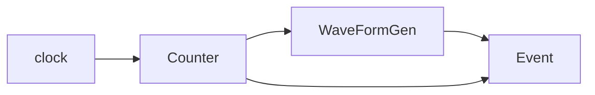
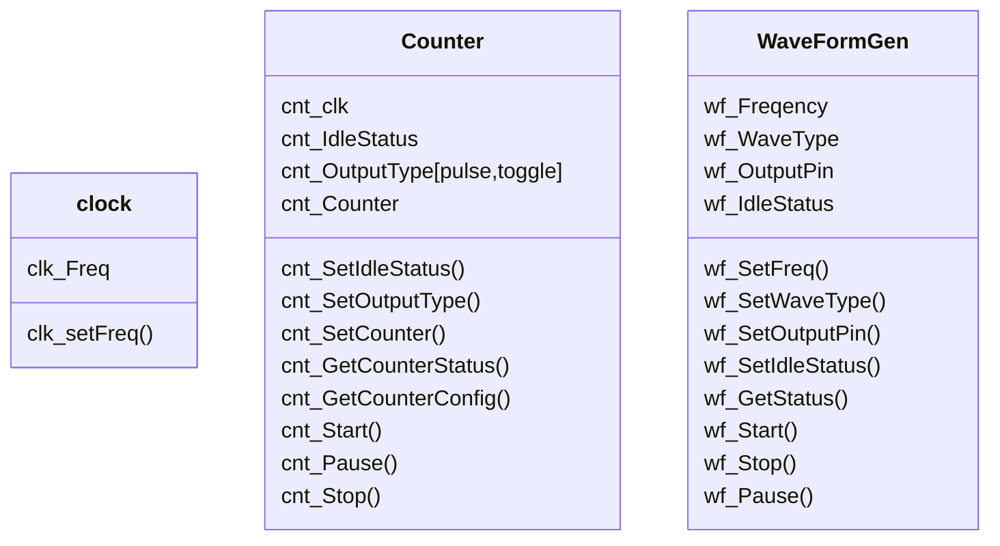
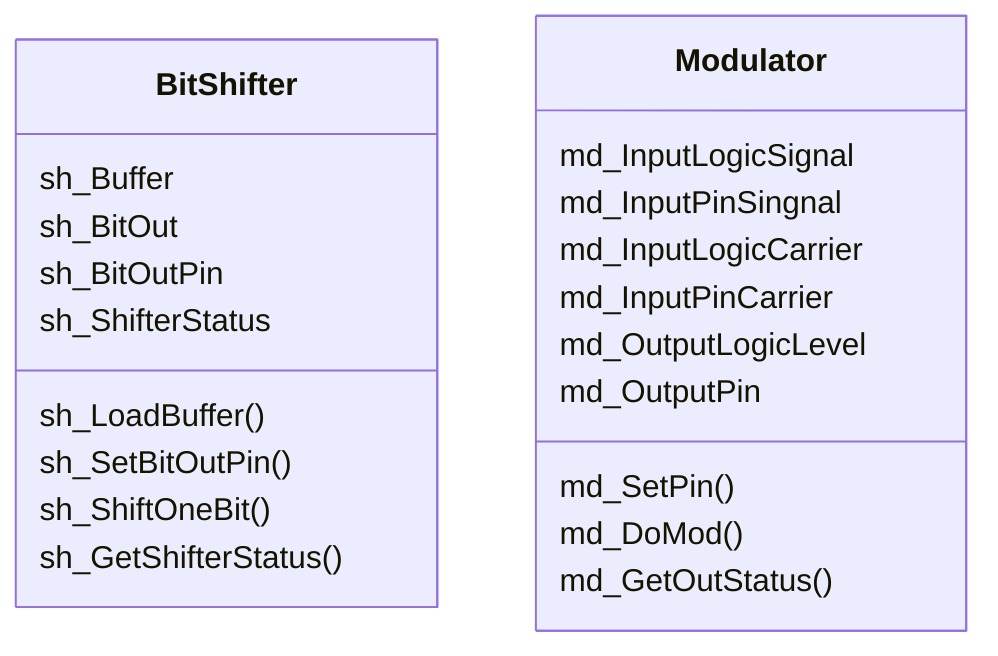

## clock, counter, divider, wave form generator
* all this discussion assume digital square wave, no analog (can discuss in AD/DA)
* clock, source of driver
  - wave `_|¯¦_|¯¦_|¯¦_|¯¦_`
  - frequency => T => T_high or T_low = T/2
  - set freq ()
* Counter, clock drive, generate event when clock numbers reach counter num
  - input clock src
  - input pin
  - output type
    - pulse, toggle 
  - output pin
  - output idle status [high, low]
  - config counter
  - set input
    - pin
  - set output
    - pin
    - type
    - idle status
  - set config
    - counter
  - get config
    - config
    - status [init/start/stop/pause/counter]
  - action
    - init
    - start
    - pause
    - stop
* clock divider
  - prescaler, special counter
    - 1/N, N=2^n n[1,2,3,4...n]
  - counter when any n>0 natural number
    - 1/n, n=2,3,4...n
* wave form [square wave] generator
  - frequency
  - duty cycle = high/low
    - 50% = counter or prescaler
  - other property from counter
  - set frequency like clock
  


## Modulation
* basic concept
  - information can send directly
    - set/clr pin status, pin status indicate information
  - information can send via carrier
    - send via serialization
    - info to control carrier each modulation unit
    - carrier have high frequency
    - infor need a serializer, bit shifer

- Modulation Example, OOK, On-Off
  ```mermaid
  graph TD
        BitShifter -- Bit --> Modulator[\Modulator<br>AND BIT,1/]
        CC[Carrier Clock] --> Modulator
        Modulator --> OutputSignal
  ```

